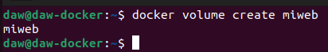
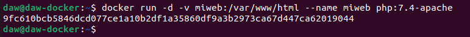
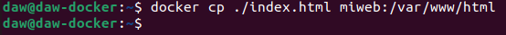
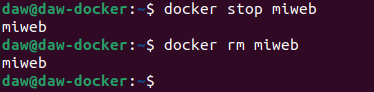

# Ejercicios Docker Almacenamiento
> Raúl Pastrana Cobo

1. Crea un volumen docker que se llame miweb.

```sh

docker volume create miweb

```



2. Crea un contenedor desde la imagen php:7.4-apache donde montes en el directorio /var/www/html (que sabemos que es el DocumentRoot del servidor que nos ofrece esa imagen) el volumen docker que has creado.

```sh

docker run -d -v miweb:/var/www/html --name miweb php:7.4-apache

```



3. Utiliza el comando docker cp para copiar un fichero index.html en el directorio /var/www/html.

```sh

docker cp ./index.html miweb:/var/www/html

```




4. Borra el contenedor

```sh

docker stop miweb (Para pararlo primero)

docker rm miweb (Para borrarlo)

```



