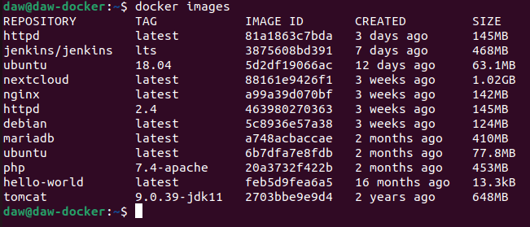
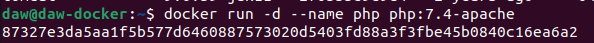
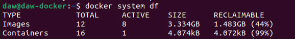
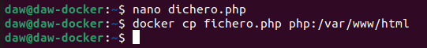
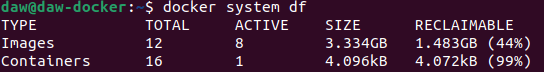

# Ejercicios Docker Imagenes
> Raúl Pastrana Cobo

1.  Descarga las siguientes imágenes: ubuntu:18.04, httpd, tomcat:9.0.39-jdk11,jenkins/jenkins:lts, php:7.4-apache.

```sh

docker pull "nombre de la imagen"

```


2. Muestras las imágenes que tienes descargadas.

```sh

docker images

```



3. Crea un contenedor demonio con la imagen php:7.4-apache.

```sh

docker run -d --name php php:7.4-apache

```



4. Comprueba el tamaño del contenedor en el disco duro.

```sh

docker system df

```



5. Con la instrucción docker cp podemos copiar ficheros a o desde un contenedor. Crea un fichero en tu ordenador, con el siguiente contenido:

<?php
echo phpinfo();
?>

Copia un fichero info.php al directorio /var/www/html del contenedor con docker cp.

```sh

docker cp fichero.php php:/var/www/html

```




6. Vuelve a comprobar el espacio ocupado por el contenedor.



7. Accede al fichero info.php desde un navegador web.
