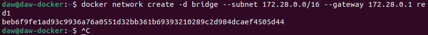
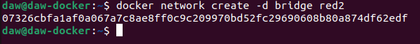
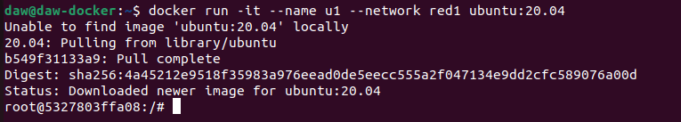

# Ejercicios Docker Redes
> Raúl Pastrana Cobo

1. Vamos a crear dos redes de ese tipo (BRIDGE) con los siguientes datos:

Red1

Nombre: red1
Dirección de red: 172.28.0.0
Máscara de red: 255.255.0.0
Gateway: 172.28.0.1

```sh

docker network create -d bridge --subnet 172.28.0.0/16 --gateway 172.28.0.1 red1

```



Red2

Nombre: red2

```sh

docker network create -d bridge red2

```



Es resto de los datos será proporcionados automáticamente por Docker.


2. Poner en ejecución un contenedor de la imagen ubuntu:20.04 que esté conectado a la red1. Lo llamaremos u1.

```sh

docker run -it --name u1 --network red1 ubuntu:20.04

```



3. Entrar en ese contenedor e instalar la aplicación ping.

```sh

apt update && apt install
inetutils-ping 

```

